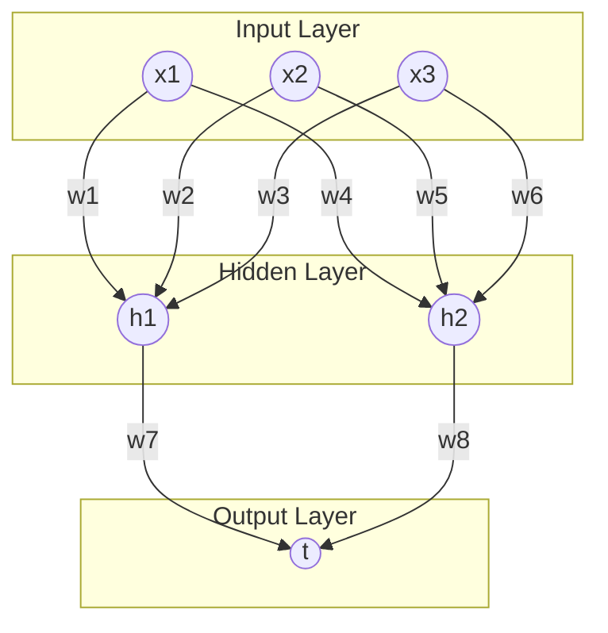

# Elements of Statistical Learning

## 1 Classification versus Regression

### Question
What is the statistical supervised learning problem on a high level, and what is difference between a classification and a regression problem? Answer in two to three sentences. 

### Answer
In statistical supervised learning we are predicting the value $y(x)$ of a target (random) variable $T$ given the value of an input variable $X = x$ such that $y(X)$ is on average a good approximation to $T$ where this average is taken with respect to the joint distribution of $X$ and $T$ that governs both, the process of sampling training data as well as the occurrence of data later when the prediction model is deployed.

In **regression** the response variable $T$ is assumed to be continuous, e.g., the predicted future price of a financial asset or the predicted temperature in a specific region. In contrast, in **classification** the response variable has a discrete domain of a finite number of categories, e.g., 'spam'/'no-spam' for e-mail classification or 'tuna', 'salmon', 'bass' for the fish classification example.

#### My Own Answers

the aim of statistical supervised ML is to predict unseen data based on training data through the prediction of a random target variable $T$ using a random input variable $X=x$ where $\phi(x)$ outputs the best approximation to $T$ over the joint probability distribution $P(X,T)$. Formally, the aim is to *find the Bayesian optimal predictor*,
$$y^*=\underset{y}{agmin}\mathbb{E}_{p(x,t)}[L(t, y(x))]$$

---

## 2 Goal of Supervised Learning

### Question
What is the ultimate goal of statistical supervised learning? How are the concepts of training error and test error related to this goal?

### Answer
The ultimate goal of predictive (supervised) learning is to find a prediction function $y(x)$ with small *generalisation error*, i.e., expected loss between target value $T$ and prediction $y(X)$ based on input value $X$:

$$
\mathbb{E}(l(T,y(X))).
$$

One aims to find such a prediction function by *minimising the training error*

$$
\frac{1}{N}\sum_{n = 1}^{N}l(t_n,y(x_n))
$$

on a set of training data $(x_{1},t_{1}),\ldots ,(x_{N},t_{N})$ that has been sampled independently and identically distributed according to the joint distribution of $X$ and $T$. The *test error*

$$
\frac{1}{M}\sum_{m = 1}^{M}l(t_{N + m},y(x_{N + m}))
$$

on further i.i.d. test data $(x_{N + 1},t_{N + 1}),\ldots ,(x_{N + M},t_{N + M})$ is then used as an unbiased estimate of the prediction function that has been found.

---

## 3 Model Selection

### Scenario
Consider the following scenario: 
• Alice wants to model the species (‘setosa’, ‘versicolor’, or ‘virginica’) of iris flowers as a function of four variables (their sepal and petal length and width) 
• She has collected a dataset of 150 examples 
•She wants to use the kNN classifier but she does not know what is a suitable value for $k$, hence shes want to choose $k$ from the set of candidates ${1, 2, ..., 10}$ based on the collected data 
• Finally, she wants a reliable estimate of the performance of the model that has been learned. Currently Alice plans to proceed with the following machine learning workflow: 
1. Split the data into 10 folds of roughly equal size. 
2. Pick the value of $k$ with the second best average test error across all folds (for each using the remaining folds as training data). In particular, she plans to use the second best “to avoid overfitting”. 
3. Use this test error as the final performance estimate. 
### Questions
Answer the following two questions: 
(a) Point out in up to two sentences, what is the most substantial problem with Alice’s proposed
workflow and why. 
(b) Describe an improved machine learning process that adequately addresses this problem. 

### Answers
**(a)** The average test error of the chosen model (corresponding to the second best $k$) obtained by Alice’s cross validation procedure is optimistically biased, because the test data is used as part of the overall training data to learn the value for $k$.

**(b)** The procedure can be corrected by first performing a training/test split, carrying out the cross validation procedure to choose $k$ only based on the training data, and obtaining a final estimate of the generalization error on the test data.

---

## 4 Normal Distribution and Maximum Likelihood Estimation

### Scenario
The (uni-variate) normal distribution is an extremely important distribution describing the behavior of continuous random variables. It is parameterized by a mean μ and a standard deviation parameters σ (or more typically by the corresponding variance parameter $\sigma^2$). Given a dataset ${x_1 , ... , x_N}$ of independent realizations of a normal random variable X, we can use the principal of maximum likelihood to find guesses for the unknown parameters. In particular, these guesses have simple closed form solutions. 

### Questions
Answer each of the following questions with one to two sentences and give mathematical derivations as appropriate: 
(a) What is the definition of the normal density function $p(x|\mu, \sigma)$? What is the key component of the definition that gives rise to the characteristic bell shape? 
(b) What is the key idea of the maximum likelihood estimation of the parameters $\mu$ and $\sigma$, i.e., what is the defining property of the maximum likelihood estimates $μ_{ML}$ and $σ_{ML}$? 
(c) How can we derive the closed form solution of the maximum likelihood estimation for the mean $\mu$? Apply this approach to derive it. 
(d) How can we derive the closed form solution of the maximum likelihood estimation for the standard deviation $\sigma$? Apply this approach to derive it. 
### Answers
**(a)** The density function of $N(\mu , \sigma^2)$, the normal distribution with mean $\mu$ and variance $\sigma^2$ is

$$
p(x|\mu ,\sigma) = \frac{1}{\sqrt{2\pi}\sigma}\exp \left(-\frac{(x - \mu)^2}{2\sigma^2}\right).
$$

The central component is the exponential reduction of the density in the normalised square of the difference of $x$ from the mean $\mu$. This creates the bell shaped curve, because of a slow reduction close to the mean (where the normalised difference is less than 1) and a rapid reduction further away from the mean.

**(b)** Given a dataset $D = (x_{1}, \ldots , x_{N})$ of observations drawn independently and identically distributed according to $N(\mu , \sigma^2)$, the idea of maximum likelihood estimation is to find estimates $\mu_{\mathrm{ML}}$ and $\sigma_{\mathrm{ML}}$ that maximise the probability of the data, i.e.,

$$
p(D|\mu_{\mathrm{ML}},\sigma_{\mathrm{ML}}) = \max \{p(D|\mu ,\sigma):\mu \in \mathbb{R},\sigma \in \mathbb{R}_{+}\}.
$$

**(c)** All partial derivatives of the likelihood function have to be 0 at the maximum likelihood estimates. Additionally, we can optimise the log likelihood instead of the likelihood (because this is a monotone transformation). With this and the assumption that the sample elements are drawn independently, a method for identifying the maximum likelihood parameters is to check where the partial derivatives of

$$
\ln p(D|\mu ,\sigma) = \ln \prod_{n = 1}^{N}p(x_{n}|\mu ,\sigma) = \sum_{n = 1}^{N}\ln p(x_{n}|\mu ,\sigma)
$$

is zero. Applying this idea to $\mu$, we find the partial derivatives as

$$
\frac{\partial}{\partial\mu}\sum_{n = 1}^{N}\ln p(x_{n}|\mu ,\sigma) = \sum_{n = 1}^{N}\frac{\partial}{\partial\mu}\ln p(x_{n}|\mu ,\sigma) = \sum_{n = 1}^{N}\frac{\partial}{\partial\mu}\left(-\ln \sqrt{2\pi}\sigma -\frac{(x_{n} - \mu)^{2}}{2\sigma^{2}}\right) = -\sum_{n = 1}^{N}\frac{x_{n} - \mu}{\sigma^{2}}.
$$

Setting the last expression to 0 and solving for $\mu$, we find that

$$
\mu_{\mathrm{ML}} = \frac{1}{N}\sum_{n = 1}^{N}x_{n}.
$$

**(d)** Applying the same principles as in (c), we find the partial derivative of the log likelihood with respect to $\sigma$ as

$$
\frac{\partial}{\partial\sigma}\sum_{n = 1}^{N}\ln p(x_n|\mu ,\sigma) = \sum_{n = 1}^{N}\frac{\partial}{\partial\sigma}\left(-\ln \sqrt{2\pi} -\ln \sigma -\frac{(x_n - \mu)^2}{2\sigma^2}\right) = \sum_{n = 1}^{N} \left( -\frac{1}{\sigma} +\frac{(x_n - \mu)^2}{\sigma^3} \right).
$$

Setting this expression to 0, plugging in our ML estimate for $\mu$, and solving for $\sigma$ gives

$$
\sigma_{\mathrm{ML}} = \frac{1}{N}\sum_{i = 1}^{N}(x_n - \mu_{\mathrm{ML}})^2.
$$

---

# Linear Regression

## 5 Derivation of Squared Error
### Scenario
For fitting the model parameters w of a linear regression model, we used the approach to minimize the squared error: $$E(w) = \frac{1}{2}\sum^{N}_{n=1}(t_n-y_n)^2$$  where 
$${(x_1, t_1 ), ... , (x_N , t_n)}$$ is the given training data and 
$y_n = \sum^{p}_{i=1}w_iφ_i (x_n)$ are the model predictions. To justify this error function, we showed that it can be derived as a maximum likelihood parameter estimation for a probabilistic model $p(t|x, w)$. 

### Questions
Answer each of the following questions with one to two sentences (including mathematical equations as appropriate). 

(a) What is the form of the probabilistic model that we assumed for the regression problem, i.e., how are the target values generated given the input vectors? 
(b) What is the likelihood function corresponding to this model? 
(c) Why is maximizing this likelihood function equivalent to minimizing the squared error function? 

### Answers
**(a)** We assumed that the conditional distribution of the target variable $T$ given the input variable $X$ follows a deterministic function $y(X)$ plus normally distributed noise (with mean 0), i.e.,

$$
T = y(X) + \epsilon,\quad \epsilon \sim N(0,\sigma^2).
$$

**(b)** With the above model, the conditional distribution of $T$ given $X$ is a normal distribution with mean $y(X)$. For a prediction function $y(x,w)$ with parameter vector $w$, the likelihood function for an individual data point $(x,t)$ is

$$
p(t|x,w) = \frac{1}{\sqrt{2\pi}\sigma}\exp \left(-\frac{(t - y(x,w))^2}{2\sigma^2}\right).
$$

**(c)** Maximising the likelihood function is equivalent to minimising the negative log likelihood. The negative log likelihood for a single data point is

$$
-\ln p(t|x,w) = \ln \sqrt{2\pi}\sigma +\frac{1}{2\sigma^2} (t - y(x,w))^2,
$$

which is the same as the squared error up to a (positive) constant factor and a constant additional term. Hence, minimising the sum of squared errors is equivalent to minimising the sum of negative log likelihood terms, which is the negative log likelihood given an i.i.d. dataset.

---

# Linear Classification
## 6 Logistic Regression

### Scenario
When using the logistic regression model for binary classification, we model the probability of the positive class $(t = 1)$ given input $x$ via the sigmoid transformation σ of a linear function $w · x$ of model parameters $w$. 

### Questions
(a) Give the log likelihood function $log p(t|x, w)$ of the logistic regression model for a single data point $(x, t)$. Hint: We used the fact that we encode the positive class with $t =1$ and the negative class with $t = 0$ to give a compact formula. 
(b) As a step towards the gradient descent algorithm for logistic regression, derive the partial derivative of the negative log likelihood (error function) $−log p(t|x, w)$ with respect to parameter $w_i$ . Derive the result in individual steps, noting what results you are using (all correct steps give partial marks).
(c) Extend your result from part (b) to the full gradient of the negative log likelihood when observing a set of $n$ training data points ${(x_1, t_1 ), ... , (x_N , t_n)}$. 

### Answers
**(a)** Given that the sigmoid transform of $\mathbf{w}\cdot\mathbf{x}$ is the modeled probability of $y = 1$, we can write the likelihood as

$$
p(t|\mathbf{x},\mathbf{w}) = \sigma(\mathbf{w}\cdot\mathbf{x})^t \bigl(1 - \sigma(\mathbf{w}\cdot\mathbf{x})\bigr)^{(1 - t)},
$$

from which we obtain the log likelihood as

$$
\ln p(t|\mathbf{x},\mathbf{w}) = t\ln \sigma(\mathbf{w}\cdot\mathbf{x}) + (1 - t)\ln \bigl(1 - \sigma(\mathbf{w}\cdot\mathbf{x})\bigr).
$$

**(b)** Using basic properties of derivatives and the property of the sigmoid function that $1 - \sigma(a) = \sigma(-a)$, we can start deriving the partial derivative with respect to $w_i$ of the negative log likelihood as

$$
\frac{\partial}{\partial w_i} -\ln p(t|\mathbf{x},\mathbf{w}) = -t\frac{\partial}{\partial w_i}\ln \sigma(\mathbf{w}\cdot\mathbf{x}) - (1 - t)\frac{\partial}{\partial w_i}\ln \sigma(-\mathbf{w}\cdot\mathbf{x}).
$$

Applying the chain rule, the derivative of the natural logarithm, and the fact that $\sigma'(a) = \sigma(a)\sigma(-a)$, we reach

$$
= -t\frac{1}{\sigma(\mathbf{w}\cdot\mathbf{x})}\sigma(\mathbf{w}\cdot\mathbf{x})\sigma(-\mathbf{w}\cdot\mathbf{x})\frac{\partial}{\partial w_i}(\mathbf{w}\cdot\mathbf{x}) - (1 - t)\frac{1}{\sigma(-\mathbf{w}\cdot\mathbf{x})}\sigma(-\mathbf{w}\cdot\mathbf{x})\sigma(\mathbf{w}\cdot\mathbf{x})\frac{\partial}{\partial w_i}(-\mathbf{w}\cdot\mathbf{x}).
$$

Simplifying gives

$$
= -t\sigma(-\mathbf{w}\cdot\mathbf{x})x_i - (1 - t)\sigma(\mathbf{w}\cdot\mathbf{x})(-x_i) = -t\bigl(1 - \sigma(\mathbf{w}\cdot\mathbf{x})\bigr)x_i + (1 - t)\sigma(\mathbf{w}\cdot\mathbf{x})x_i.
$$

This further simplifies to

$$
= -(t - \sigma(\mathbf{w}\cdot\mathbf{x}))x_i.
$$

**(c)** When we look at a whole training dataset $D = \{(\mathbf{x}_1,t_1),\ldots,(\mathbf{x}_N,t_N)\}$ drawn independently and identically distributed, the corresponding negative log likelihood function becomes

$$
L(\mathbf{w}) = -\ln \prod_{n = 1}^{N}p(t_n|\mathbf{x}_n,\mathbf{w}) = -\sum_{n = 1}^{N}\ln p(t_n|\mathbf{x}_n,\mathbf{w}).
$$

Using the result from (b) and the sum rule of derivatives, the partial derivative can then be computed as

$$
\frac{\partial}{\partial w_i} L(\mathbf{w}) = -\sum_{n = 1}^{N}(t_n - \sigma(\mathbf{w}\cdot\mathbf{x}_n))x_{n,i}.
$$

The gradient $\nabla L(\mathbf{w})$ can therefore be compactly written as

$$
\nabla L(\mathbf{w}) = -\sum_{n = 1}^{N}(t_n - \sigma(\mathbf{w}\cdot\mathbf{x}_n))\mathbf{x}_n.
$$

---

# Latent Variable Models
## 7 Document Clustering Model

### Scenario
Suppose we are given a collection of documents $D$. The data set $D$ is represented as ${x_1 , x_2, x_3 , ..., x_N }$ where $x_i$ is a d-dimensional “count vector” representing the i-th document, based on bag-of-words and with respect to a word vocabulary of size $d$. We are interested in fitting a Mixture multinomial model onto this dataset. 

### Questions
(a) An individual cluster is described by a vector of word occurrence probabilities $\mu$ where $\mu_j$ describes the probability of a word in a document to be the j-th word in the vocabulary. Give a formula of the probability $p(x|\mu)$ of a count vector $x$ given word occurrence probabilities $\mu$ and give a brief explanation of the formula (one to two sentences). Hint: remember that, for simplicity, we assumed the individual counts to be independent. 
(b) Write down the “Q-function”, which is the basis of the Expectation-Maximization (EM) algorithm for maximizing the log-likelihood. Notice that you do not need to write the EM algorithm in this part. 
(c) Write down the “hard” as well as the ”soft” Expectation-Maximization (EM) algorithm for estimating the parameters of the model. If necessary, provide enough explanation to under- stand the algorithm that you have written. Also briefly explain what is the main difference between hard and soft EM. 

### Answers
**(a)** Following the notation used in Module 4, we reiterate the probabilistic model. We would like to partition $N$ documents into $K$ clusters. We represent each document $x_n$ under a bag of words representation (BoW) coming from a dictionary denoted by $A$. We use mixture multinomial models to model our latent variable model. Each document $x_n$ is first generated by being allocated to a cluster $k$ under a multinomial distribution (parameter $\phi$). Given the cluster $k$ for $x_n$, each word is generated from a multinomial model (parameters $\mu_k$). As such, we define the following constraints:

$$
\ln p(x) = \ln \left(\prod_{n=1}^{N}p(x_n)\right) = \ln \left(\prod_{n=1}^{N}\sum_{k=1}^{K}p(x_n|z_n,k=1)p(z_n,k=1)\right) = \sum_{n=1}^{N}\ln \sum_{k=1}^{K}\left(\phi_{k}\prod_{w\in A}\mu_{k,w}^{c(w,x_n)}\right).
$$

**(b)** We use expectation maximisation to find the parameters $\theta$ which are $\phi_k$ and $\mu_{k,w}$. As such, we need to find $Q$ – a tractable lower bound function of the likelihood function. For the typical 'soft' expectation maximisation function, this $Q$ function is derived by using Jensen’s inequality and the Kullback-Leibler (KL) divergence:

$$
Q(\theta ,\theta^{\text{old}}) = \sum_{n = 1}^{N}\sum_{k = 1}^{K}p(z_n,k = 1|x_n,\theta^{\text{old}})\ln p(x_n,z_{n,k}|\theta).
$$

The update formulas are:

$$
\phi_k = \frac{1}{N}\sum_{n = 1}^{N}z_{n,k}^{*},\qquad \mu_{k,w} = \frac{\sum_{n = 1}^{N}z_{n,k}^{*}c(w,x_n)}{\sum_{w'\in A}\sum_{n = 1}^{N}z_{n,k}^{*}c(w',x_n)}.
$$

For the **hard EM**, we do not need the expectation over all $K$ clusters; rather, we just need the most likely $k$ for the calculation of the lower bound Q function, and thus the updated parameters $\theta$. Therefore, for each individual document $x_n$, we define:

$$
z_{n,k}^{*} = \begin{cases} 1 & \text{if } k = \arg\max_{k'} p(z_n,k' = 1|x_n,\theta^{\text{old}}), \\ 0 & \text{otherwise}. \end{cases}
$$

Our lower bound Q function is now:

$$
Q(\theta ,\theta^{\text{old}}) = \sum_{n = 1}^{N}\sum_{k = 1}^{K}z_{n,k}^{*}\ln p(x_n,z_{n,k}^{*}|\theta).
$$

---

# Neural Networks
## 8 Forward and Backward Propagation
### Scenario
Given a neural network $f(·)$ and a dataset $D = {(x_1, y_1), (x_2 , y_2), ..., (x_n , y_n)}$ where $x_i$ is a 2-dimensional vector and $y_i$ is a scalar value which represents the target. ${w1, w2 , ..., w_n }$ are learnable parameters. $h$ represents a linear unit. For example $t_i = h_1w_7 +h_2w_8$. The error function for training this neural network is the sum of squared error: $$E(w)=\frac{1}{2}\sum^{N}_{n=1}(yi-ti)^2$$ with the nodes as,

### Questions
(a) Suppose we have a sample $x$, where $x_1 =0.5, x_2 =0.6, x_3 =0.7$. The network parameters are $w_1 =2, w_2 =3, w_3 =2, w_4 =1.5, w_5 =3, w_6 =4, w_7 =6, w_8 =3$ Next, let’s suppose the target value $y$ for this example is 4. Write down the forward steps and the prediction error for this given sample. Hint: you need to write down the detailed computational steps. 
(b) Given the prediction error in the previous question, calculate the gradient of $w_1$, namely $\frac{∂E}{∂w1}$. Please also write down all involved derivatives

### Answers
**(a)** Given the network with inputs $X_1=0.5, X_2=0.4, X_3=0.3$, weights $W_1=2, W_2=3, W_3=4, W_4=5, W_5=6, W_6=7, W_7=6, W_8=5$, and target $y=4$:

$$
h_1 = X_1\cdot W_1 + X_2\cdot W_3 + X_3\cdot W_5 = 0.5\cdot2 + 0.4\cdot4 + 0.3\cdot6 = 1 + 1.6 + 1.8 = 4.3
$$
$$
h_2 = X_1\cdot W_2 + X_2\cdot W_4 + X_3\cdot W_6 = 0.5\cdot3 + 0.4\cdot5 + 0.3\cdot7 = 1.5 + 2.0 + 2.1 = 5.2
$$
$$
t = h_1\cdot W_7 + h_2\cdot W_8 = 4.3\cdot6 + 5.2\cdot5 = 25.8 + 26.0 = 51.8
$$
$$
E = \frac{1}{2}(y - t)^2 = 0.5 \cdot (4 - 51.8)^2 = 0.5 \cdot (-47.8)^2 = 0.5 \cdot 2284.84 = 1142.42
$$

**(b)** According to the chain rule, we have

$$
\frac{\partial E}{\partial w_1} = \frac{\partial E}{\partial t}\cdot \frac{\partial t}{\partial h_1}\cdot \frac{\partial h_1}{\partial w_1},
$$

where $\frac{\partial E}{\partial t} = t - y = 51.8 - 4 = 47.8$, $\frac{\partial t}{\partial h_1} = w_7 = 6$, $\frac{\partial h_1}{\partial w_1} = x_1 = 0.5$. Hence the solution is $47.8 \cdot 6 \cdot 0.5 = 143.4$.